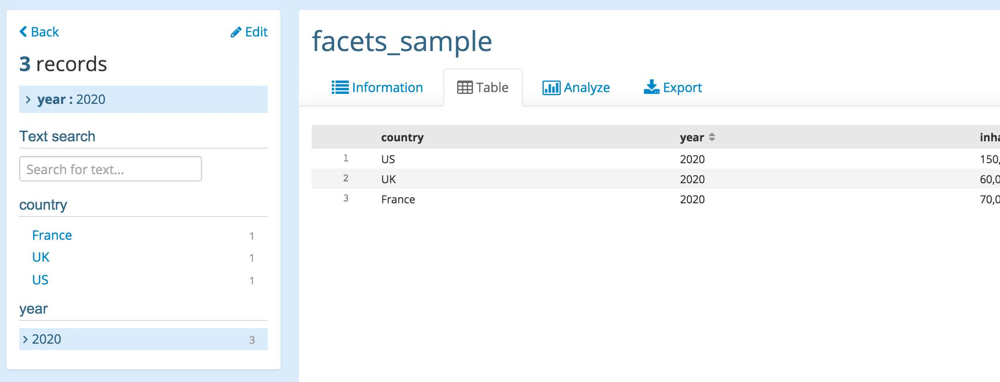
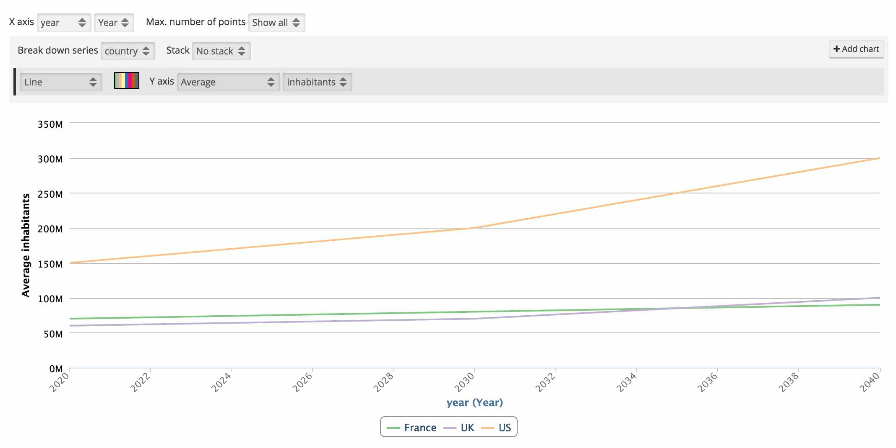

# FAQ

## What is OpenDataSoft?
OpenDataSoft is a turnkey SaaS platform developed for business users to easily share, publish and reuse structured datasets.

## Is OpenDataSoft open source?
OpenDataSoft is not open source. 

OpenDataSoft is selling a service, not a software. However, some parts of the stack are going to be open source. 

In the short term, we will fully release the data exploration front-end, including search and data visualization widgets. 

In the long term, we might want to open source our data collection and processing framework. 

We are also already contributing to the [Elasticsearch](http://www.elasticsearch.org/) ecosystem as we have published Open Source geo related aggregation plugins (more details [here](https://github.com/opendatasoft)).

## Is the OpenDataSoft team managing data on behalf of its customers?
No. 

OpenDataSoft sells a turnkey solution. Users manage their datasets themselves. Of course, the OpenDataSoft support team is more than willing to help them handling complex / specific data management issues.

## I'm representing a public administration. My country has already setup an Open Data initiative. Why should I have my own data portal?
Open Data is about making data that has been produced by public administrations available to citizens. But most of the time, one may want to go beyond simple delivery of raw files and:

* Contextualize & increase the value of data
* Make data easy-to-understand for citizens
* Provide open services to an ecosystem of developers/reusers

To that extent, having a data management tool tailored to your needs is mandatory, the important part being that data produced by your local platform should be referenced on your country's Open Data portal.

## If I put datasets in OpenDataSoft, will they automatically be available to everyone on the Web?
No. 

The OpenDataSoft platform can be used for both public and private data management projects. A given platform can even host public and private datasets. It is also possible to define the ACL of a records set at dataset level.

## Which file formats are supported by OpenDataSoft?
The OpenDataSoft platform natively supports a wide range of data formats:

* GeoJSON
* KML
* Shapefile
* OSM archives (OpenStreetMap)
* GTFS archives
* Remotely stored files for any of the above formats (HTTP or FTP)

Specific format parsers can also be made available by the OpenDataSoft team for specific requirements. It is also possible to ask for the development of a specific connector that would directly connect to an internal information system endpoint providing data through a proprietary API.

## What metadata standards does OpenDataSoft support?
OpenDataSoft natively uses a subset of [DCAT](http://www.w3.org/TR/vocab-dcat/) to describe datasets. The following metadata are available: **title**, **description**, **language**, **theme**, **keyword**, **license**, **publisher**, **references**.

It is possible to activate the full DCAT template, thus adding the following additional metadata: **created**, **issued**, **creator**, **contributor**, **accrual periodicity**, **spatial**, **temporal**, **granularity**, **data quality**.

A full [INSPIRE](http://inspire.ec.europa.eu/index.cfm/pageid/101) template is also available and can be activated on demand.

The creation of a fully custom metadata template can also be done.

## How many datasets can I create?
You can create as many datasets as you want within the limit set in your licensing plan.

## How could I modify the look & feel of my OpenDataSoft domain?
As a domain administrator, you can modify the color palette of your portal. For more advanced customizations, for the time being, this has to go through OpenDataSoft. OpenDataSoft shall release new ways to customize a portal in the near future (CSS).

## How can other people collaborate on dataset configuration?
Use the security tab to give other users or group of users a write access to the dataset. These users must also have access to the domain to access your dataset. If this is not the case already, contact your domain administrator.

## How can I transform and enrich my datasets?
A rich set of processing features is made available in the publishing console. Simply hit the **Add Processor** button.

## Can I geocode a full-text address?
Yes. 

OpenDataSoft supports Google and ESRI geocoding services. However, OpenDataSoft doesn't come with geocoding API keys. The domain administrator has to configure a geocoding API key for one of these services in the domain configuration page.

The geocoders are not activated by default. Please contact OpenDataSoft support for more details.

## I have geocoded data in my dataset but the map view doesn't display anything. What went wrong?
Remember that a **Geo Point 2D** field values must be formatted in a specific way: `latitude,longitude` (e.g. `48.2567,3.7689`).

## What is a facet?

Facets are the backbone of most of the features made available by the OpenDataSoft platform. A facet is simply a field which has been given specific filtering and aggregation capabilities.

In the example above, the fields **country** and **year** have been defined as facets (notice the filter button next to the type select).

Facets can be seen as dimensions of a dataset. Facets can be defined on the following field types: **date**, **datetime**, **text**, **int**, **decimal**.

Facets shall only be configured for fields that have a small number of different values compared to the number of records in a dataset. For instance, defining a facet on an field that would uniquely identify a record is useless as filtering on this field would't bring any added value.

Facets are then used in a couple of places.

You can first use them to filter dataset records in the explore console.

As dimensions, facets support aggregations. You can thus use them to build advanced charts, as in the example below.

## I'm using OpenDataSoft playground. How could I run my own data portal?
Please send a message to <contact@opendatasoft.com>. 

We will be happy to discuss your needs and to propose you one of our plans.

## How can I display points on a map ?
For a geo data visualization to be available, your dataset needs to contain a **Geo Point 2D** field with content under the `latitude,longitude` form. For instance: `48.2567,3.7689`.

## In the table view, I have not been able to sort the results using a specific field; what went wrong ?
By default, only the numerical fields are sortable. That is **int**, **double**, **date** and **datetime**. **Text** fields are not sortable by default. The dataset owner may configure some text fields to be sortable. Sortable **text** fields can be identified through the API (`sortable` annotation).

## I published a dataset, but no category is displayed in the left column. What shall I do ?
Categories (facets) are built out of fields which have been defined as a **facet**. To set a field as a facet, simply click on the **filter** icon, in the field definition header in the publishing console.

## When I go to the analyze view, the displayed chart doesn't make any sense. How could I change this ?
The dataset owner can easily define the default analytical representation of the dataset using the **analyze tab** of the publishing console. End-users can also simply choose different settings and build their own analytical data visualization using the available controls.

## On some portals powered by OpenDataSoft, I have seen nice image galleries displayed as data visualizations. How could I do the same ?
The image support feature is still in beta version. Contact the OpenDataSoft support team if you would like to try it. This feature introduces a new data source which can handle compressed archives containing image files along with metadata.

## How can I embed a data visualization on my website ?
There are three ways to embed OpenDataSoft data visualizations on a website or any content management system:

* Copy-paste the embed code that can directly be found on the OpenDataSoft platform (usually located under the data visualization itself).
* Use [ODS Widgets, our open source widget library](https://github.com/opendatasoft/ods-widgets)
to build content pages tailored to your needs with one or several data visualizations at once.
Complete documentation is available here: http://opendatasoft.github.io/ods-widgets/docs/
* Use our HTTP/REST APIs to develop your own widgets.

## What is "Cartograph" ?
Cartograph is a tool developed by OpenDataSoft to make it possible to build geo mashups out of datasets stored on the OpenDataSoft platform.

## What are APIs made for ?
APIs are a set of tools that developer can use to integrate data in their applications (Web applications, mobile applications, business applications...).

## How many API calls can I perform ?
API endpoints are associated with quotas. OpenDataSoft customers can configure their own quotas policy. Contact your OpenDataSoft domain owner for more details.

## Does each dataset have its own APIs ?
Yes and no.

No, because all our [APIs](/article/1389-available-apis) can be used with any dataset. 

Yes, because giving the dataset, the filtering and facetting features will vary as the dataset defines the available fields for **querying**, **sorting** and **facetting**.
