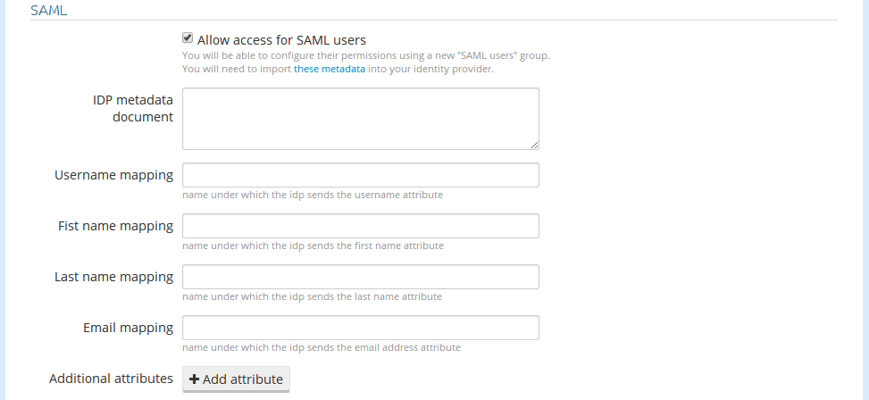

# SAML support

The OpenDataSoft platform supports the SAMLv2 standard.
This allows to create identity federation between your domain, which will act as a service provider, and a identity provider that you can configure.
This federation allows users of your domain to connect to the platform using the identity provider, and if they have one, reuse their active security context to create a SSO mechanism.

### Register and configure an identity provider

1. Navigate to the integration page in the domain configuration interface.

    

2. Check "Allow access for SAML users"

    

3. Paste your identity provider metadata document in the "IDP metadata document" field.

4. Input the attributes mappings for the username, last name, first name and email address.

    Here, you need to declare the fields names as they are sent by the identity provider.
    For instance, if your identity provider transmits the connected user's first name in an attribute called "GivenName", this is what you will need to type in the "First name" field.
    If for any reason your identity provider doesn't send all of these elements, let the corresponding fields blank. The platform will automatically generate them based on other available attributes.  

5. Optionally input the attributes mappings and types of other attributes that are sent by your identity provider.

    For instance, if your identity provider sends a list of the user's allergies, under the field name "Allergies", you may add an attribute mapping with name "Allergies", and type "list". This allows for interesting dataset filters with the `attr` function.

### Configure your identity provider

The configuration of the identity provider is implementation-dependant, but it always consist of importing the service provider metadata document to enable a identity federation.
You can download the metadata document for your OpenDataSoft domain on https://\<YOUR DOMAIN\>.opendatasoft.com/saml2/metadata.xml

