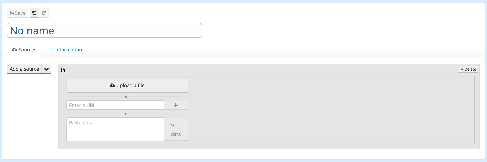

# Creating a Dataset

To create a new dataset, simply go to the publish console, accessible by hitting the **Publish** button (usually located at the right side of the header), while connected with an account that has publishing privileges.

You can also access the publish console through its direct link: https://<DOMAIN_NAME>.opendatasoft.com/publish.

### Creating and publishing a new dataset

The dataset creation workflow is very simple.

1. Hit the **New** button

    

2. Add a new data source by hitting the **Add a source** button

    

    Note that this step is optional as you can configure a dataset with no datasource, simply filling out the dataset metadata in the **Information** tab.

3. Define your data source

    

    You can either:

    * **Upload a file** whose format is supported by the platform
    * Specify a **remote URL** (HTTP, HTTPs or FTP) to a file whose format is supported by the platform
    * Specify a **remote URL** to an **API endpoint** supported by the platform
    * **Paste data**, for instance by copy / pasting Excel spreadsheet content

    Note that you can define multiple resources for a single dataset. However, all the resources shall have the same *schema* (for instance, a CSV file and an XLS file with the same column titles).

4. **Save** and **publish** your newly created dataset

    

### Supported file formats

The following table lists the supported format and describes configuration options for each format.

Format | Extensions | Description
------ | ---------- | -----------
CSV | .csv, .tsv, .txt, .dat | The platform lets you configure the file encoding, the field delimiter as well as a couple of other useful options.
Microsoft Excel | .xls, .xlsx |
OpenDocument SpreadSheet | .ods |
GeoJSON | .json, .geojson |
JSON | .json | Simple JSON documents are supported. The platform lets you choose the root path (path to the table of elements to be considered as rows) and the properties path (path to the dictionnary holding the list of fields for an element).
KML | .kml |
Shapefile |  .zip | A zip archive containing at least the following files: <NAME>.shp, <NAME>.dbf, <NAME>.prj
MapInfo | .zip | A zip archive containing either <NAME>.mid and <NAME>.mif files or <NAME>.map, <NAME>.tab, <NAME>.id and <NAME>.dat
OpenStreetMap | .osm |

File formats support can be extented to match specific requirements (for instance, to support a complex XML DTD or a non standard flat file format). Contact your local support team if you need more information on file formats support extension.

OpenDataSoft supports compressed files (ZIP and BZ2).

### Connecting to a remote API endpoint

Sometime, it might be proven convenient to *connect* a dataset to a remote data source exposing data records over an HTTP API.

OpenDataSoft natively supports the following APIs (contact your local support team to get these activated on your domain):

 * [JCDecaux Developer API](https://developer.jcdecaux.com/)
 * [ArcGIS REST API](http://resources.arcgis.com/en/help/rest/apiref/)
 * [Netatmo HTTP API](https://dev.netatmo.com/doc)

OpenDataSoft can also develop and integrate customer specific Web APIs. OpenDataSoft connectivity toolkit makes it possible to develop performant and secured connectors supporting incremental data processing.
