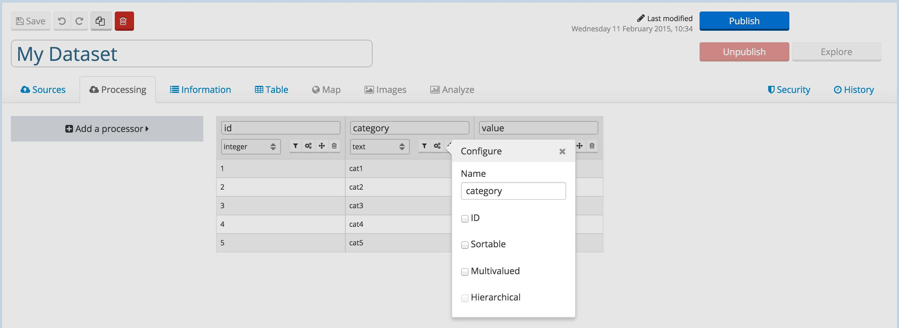
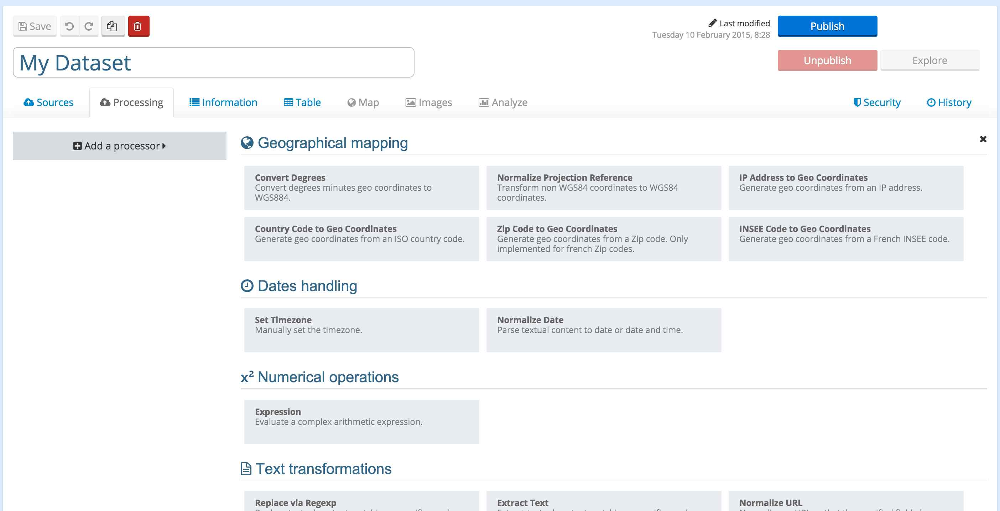

# Transforming a Dataset

One of the most important step in the publication workflow is related to the possibility to shape your dataset to your exact needs.

Not only can you store the raw data coming from the data source feeding the dataset. You can also fine tune the dataset schema and even alter the content of your records.

All these transformations take place in the **processing** tab of the dataset configuration pane.

### The dataset schema

As seen in a previous article, a dataset content can be seen as flat database table. That is:

* A schema (the list of fields along with their types and possibily some annotations)
* A set of records (rows or tuples) matching the schema

Whatever the original data source format is, the dataset content ends up as a flat database table content.

Fields have a type. The following types are available:

<table>
<tr><th>Type</th><th>Description</th></tr>
<tr><td>Date</td><td>Like 2015/02/11 or 2015-02-11 or 02/11/2015... . The platform will try to guess as accurately as possible the input date format. However, in case of bad detection or ambiguity, do not hesitate to use the <strong>Date Normalizer</strong> processor which lets you define precisely the parsing format of your date field.</td></tr>
<tr><td>DateTime</td><td>Like 2015/02/11-08:09:10 or 2015-02-11T08:09:10 or 02/11/2015 08:09:10... . Timezone specifications are also processed. The platform will try to guess as accurately as possible the input datetime format. However, in case of bad detection or ambiguity, do not hesitate to use the <strong>Date Normalizer</strong> processor which lets you define precisely the parsing format of your datetime field.</td></tr>
<tr><td>Decimal</td><td>A decimal number. Valid separators for the decimal part are '.' or ','. The space character can also be used as a thousands separator but not the ','.</td></tr>
<tr><td>Geo&nbsp;Point</td><td>A single geographical location expressed in the format <em>&lt;LAT&gt;,&lt;LON&gt;</em>, for instance <em>45.8,2.5</em>. If your dataset contains two fields, latitude and longitude, you'll need to concatenate them with a <strong>Concatenate Text</strong> processor to form a valid geo point field.</td></tr>
<tr><td>Geo&nbsp;Shape</td><td>A valid geo shape expessed in GeoJSON.</td></tr>
<tr><td>Integer</td><td>Any valid integer value. If a floating point value is found, it is automatically cast to its integer part.</td></tr>
<tr><td>Text</td><td>Anything</td></tr>
</table>

Next to their type, any field has a set of action items, which can be used to further refine your dataset schema.

* The **filter action** lets you define a **facet** for the field.
* The **field configuration action** will be described in more details below.
* The **reorder fields action** lets you reorder dataset fields at your convenience. This only affects the dataset API output.
* The **hide fields action** lets you hide specific dataset fields. Hidden fields are displayed at the right hand side of the table view and can easily be recovered.

### Configuring a field
The **field configuration button** allows you to fine tune your field's configuration.

The generic option **ID** let's you define the record id computing policy. Each record is uniquely identified by its id, which is by default computed as the fingerprint of all the record fields values. The **ID** option lets you choose which fields are going to be used when computing the record id, making it possible to handle records deduplication at record fields level.

You then have access to a wide range of options depending on the field type.

* Text fields
    * **Sortable**

        By default, textual fields are not sortable. This option lets you activate sorting on textual fields.

    * **Multivalued**

        This option lets you define the separator that will be used to interpret multi-valued fields. This option is used for multi-value facetting. For instance, let's assume that a field named *countries* and defined as a facet contains values such as *France;UK;USA*. By setting this field as multivalued and defining the separator as being the ';' character, the values displayed in the facets widget will indeed be distinct (one entry for *France*, one entry for *UK*, one entry for *USA*).

    * **Hierarchical**

        This property is used in conjunction with facetting. By default, facets are processed as a single, raw textual content. But sometimes, you may want to build hierarchical facets navigation. This option lets you choose the hierarchy path separator to be used.

* Date and DateTime fields
    * **Precision**

        This option lets you choose the precision of a temporal field (year, month and day for a Date field, year, month, day, hour and minute for a DateTime field).

* Decimal and Integer fields
    * **Unit**

        This option let's you define an optional unit associated with numerical fields. This option is used to complement the table view and is displayed next to the field's value.

### Transforming your dataset

In the same screen, you also have accesss to the processors configuration. A processor is a component which lets you modify the content of your dataset: concatenate values, extract text matching a specific expression, perform numerical operations, geocode full text addresses...

The exhaustive list of processors and associated configuration parameters and features are described in dedicated articles in the same section.

### Impacts of changing the dataset schema or the processors configuration
When you update the configuration of your dataset in a way that has an impact on the content (record values) of the published dataset, the full dataset content has to be republished. The only cases when changing a parameter in the processing tab doesn't require republishing are the following:

* Modifying a field's label
* Reordering the fields
